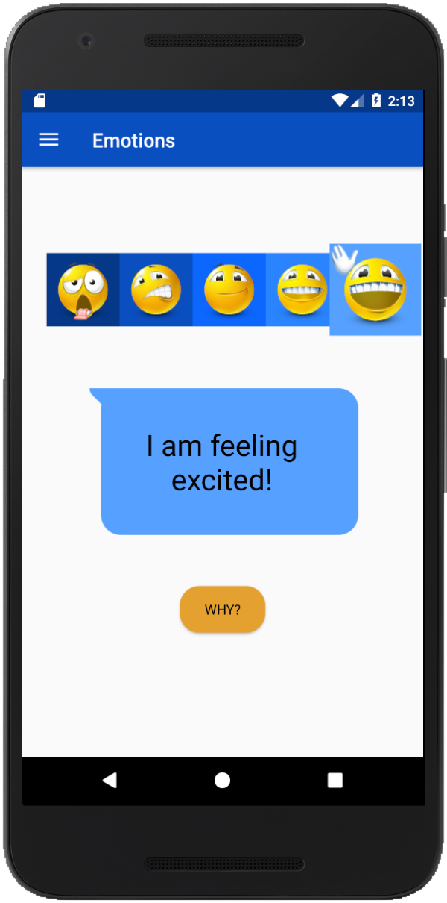

# HackGSU-AnthemApp
An application that is based off of the company Anthem's app, Vitals. It helps associates share their experience working at Anthem.

## Description ##
* UI design in Android Studio
* Coded in Java

